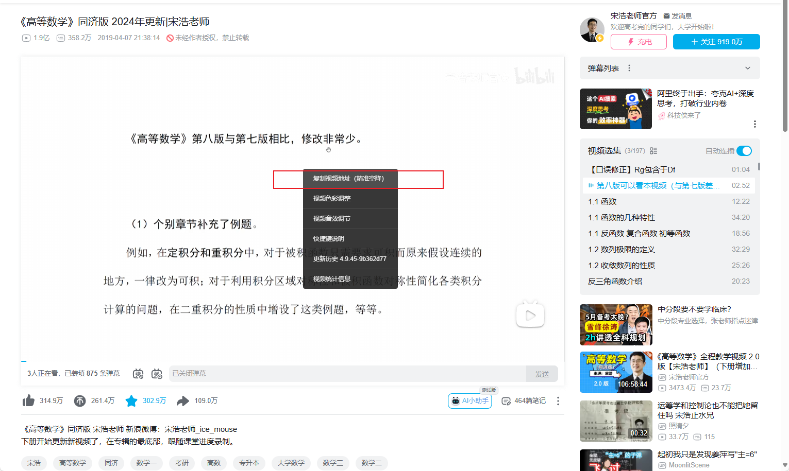
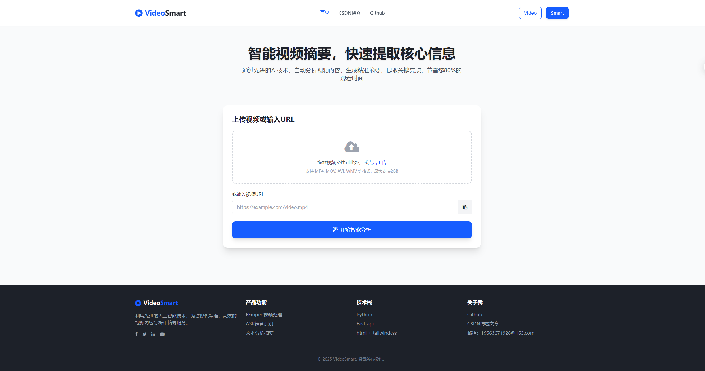
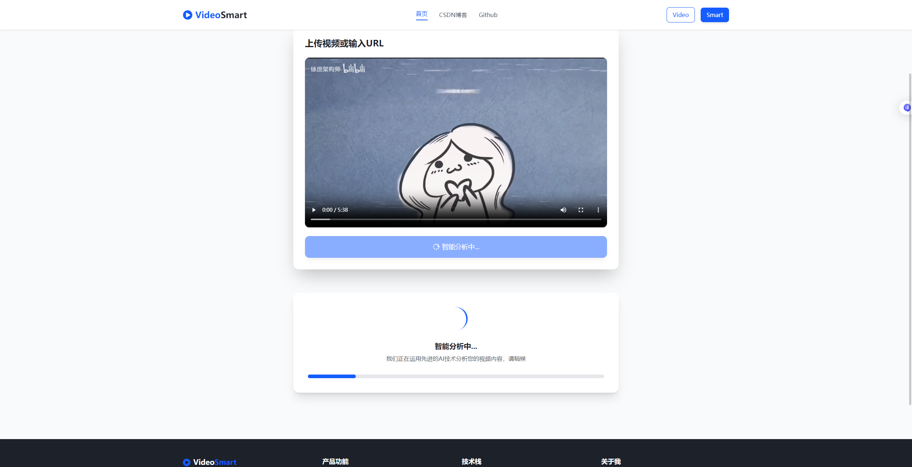
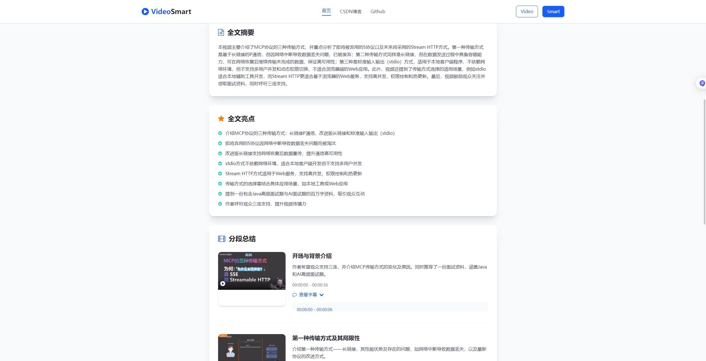
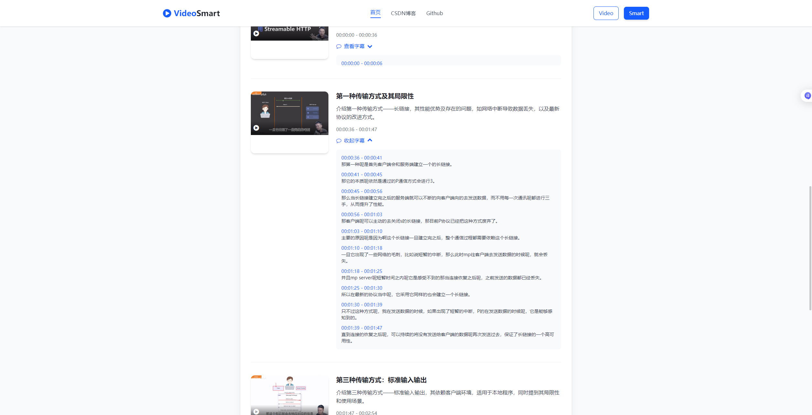
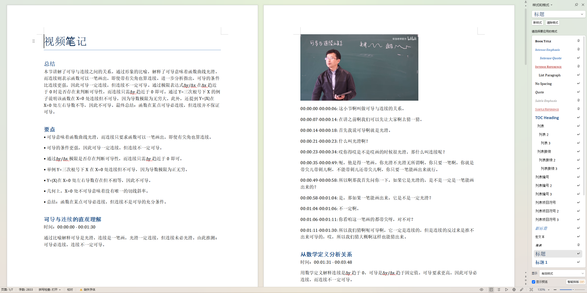

# 快速开始
安装依赖，推荐 Python 3.12+
```bash
pip install -r requirements.txt -i https://pypi.tuna.tsinghua.edu.cn/simple
```

修改配置 config/config.yaml
```yaml
# 阿里云 oss
oss:
  access_key_id: "access_key_id"
  access_key_secret: "access_key_secret"
  region: "cn-beijing"
# 阿里云百炼 LLM
llm:
  api_key: "api_key"
```

运行项目
```bash
python main.py
```

# 操作手册
1. 目前 URL 解析仅支持哔哩哔哩，视频链接请右键点击 `复制视频地（精准空降）`，**请勿复制浏览器顶部的URL地址**
    
2. 上传本地视频单击上传 mp4 即可。

# 项目概要
## 技术栈
Python、fastapi、Jinja2、OSS、html、tailwindcss 等。
## 项目结构
```text
project-name/
├── README.md           # 项目总说明
├── plugin/             # 外部二进制工具
│   ├── ffmpeg        
│   ├── yt-dlp    
├── service/            # 后端主流程
│   ├── workflow.py     
├── ui/                 # 前端代码
├── util/               # 工具类目录
└── main.py             # Web启动入口
```
## 功能点
- 上传视频文件或解析视频链接，通过 ffmpeg 实现音视频分流，音频上传阿里云oss，使用ASR转文字和时间范围。 
- 转录文字稿送入 Qwen LLM 生成【全文摘要】和【全文亮点】，并进行分段处理, 要求模型返回指定JSON格式。
- 汇总结果，ffmpeg 截取视频图片，使用 jinja2 模板生成图文混排报告（包括在线html预览、docx报告）

# 项目截图








导出 docx 文件
